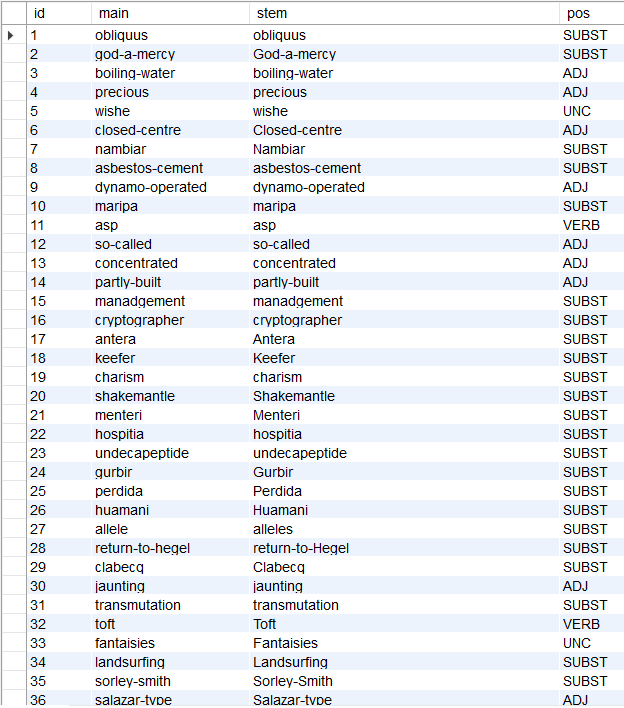

# British National Corpus parser

This project is aimed to parse [BNC](http://www.natcorp.ox.ac.uk/) to get word forms.

## Getting Started

Before run the project you\'ll need to prepear the database to store the result. In our case, we collect word forms, so import __sql__ file from __mysql__ directory:
``` cmd
$>mysqldump -u[USER] -p[PASSWORD] [HOST] [DATABASE_NAME] < [PROJECT_DIR]/mysql/bnc.mysql
```
Then build and run the program:

```
$>cargo build && cargo run
```

## Results

In the exmaple below we get the following data from [BNC](http://www.natcorp.ox.ac.uk/):
- **main** - dictionary word\'s form
- **stem** - word form
- **pos** - part of speech 



## What is BNC

The British National Corpus (BNC) is a 100 million word collection of samples of written and spoken language from a wide range of sources, designed to represent a wide cross-section of British English from the later part of the 20th century, both spoken and written. The latest edition is the BNC XML Edition, released in 2007.

The written part of the BNC (90%) includes, for example, extracts from regional and national newspapers, specialist periodicals and journals for all ages and interests, academic books and popular fiction, published and unpublished letters and memoranda, school and university essays, among many other kinds of text. The spoken part (10%) consists of orthographic transcriptions of unscripted informal conversations (recorded by volunteers selected from different age, region and social classes in a demographically balanced way) and spoken language collected in different contexts, ranging from formal business or government meetings to radio shows and phone-ins.